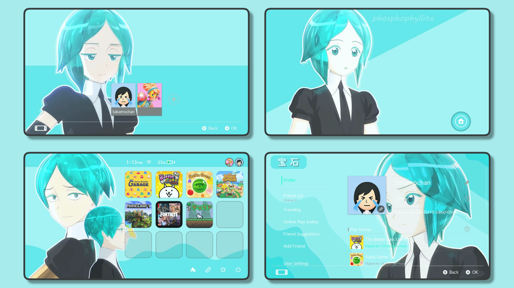
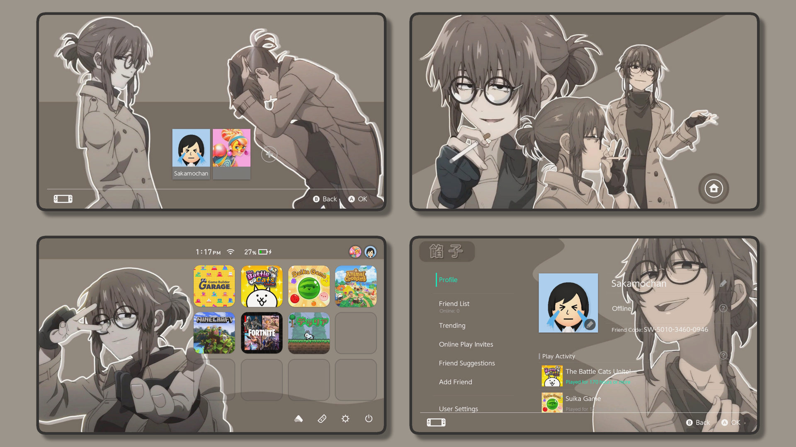

<div align="center">
    <h1>NXTheme-lib</h1>
    <div align="left">
        
        <br>
        <br>
        This is a custom Nintendo Switch theme I created.  
        <br>
        I share some of them here.  
        <br>
        They are free to download and use.  
        <br>
        You can star me if you like. ★
    </div>

</div>

<br>
<br>

<h2>Themes</h2>

<br>

| Name | Logo (1280x720) | Download |
| :----: | :----: | :----: |
| Phosphophyllite |  | [Download](./lib/NX_Phosphophyllite/themes/) |
| Makima |  | [Download](./lib/NX_Makima/themes/) |
| UguisuAnko |  | [Download](./lib/NX_UguisuAnko/themes/) |

<br>
<br>

<h2>Getting Started</h2>

An unprotected Switch with CFW is required. OLED or Lite are not supported.

<h3>Installing Themes</h3>

Copy the folder containing the downloaded `*.nxtheme` to the Themes folder in CFW.
<br>
```shell
sdmc:/themes/*.nxtheme
```

<h3>Remote Install</h3>

Download [Switch Theme Injector](https://github.com/exelix11/SwitchThemeInjector/releases/tag/v4.7.1)
<br>
Launch the theme installer and select remote install, then run the following command
<br>
```shell
SwitchThemes.exe install 192.168.X.X "*.nxtheme"
``` 
`192.168.X.X` is the console IP address of the Switch itself

<br>

<h2>More</h2>

For more information

* [Atomsphere-NX](https://github.com/Atmosphere-NX/Atmosphere)  

* [Switch Theme Injector](https://github.com/exelix11/SwitchThemeInjector/)

<br>

<h2>Credits</h2>

[Sakamochanq](https://github.com/Sakamochanq) - Creator
